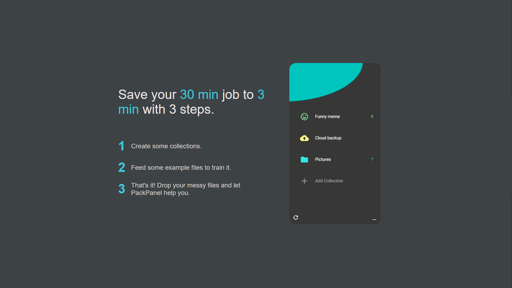
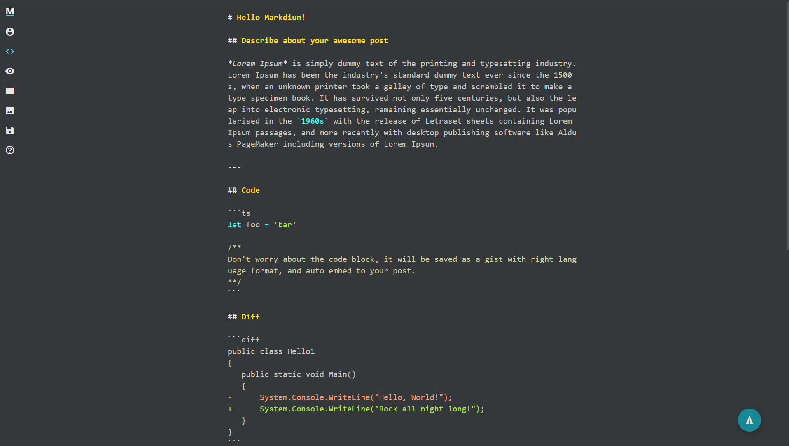
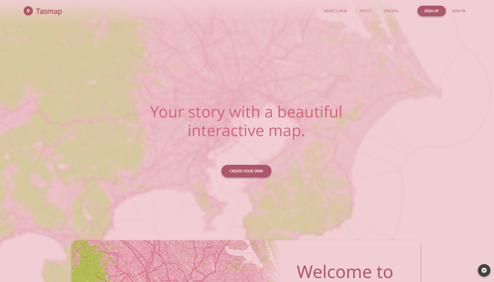

# Resume

Hi, I'm Eddie Hsu, a indie developer in Taiwan. 8+ year experiences, skilled in web & cross-platform apps.
* Contact Me: [apolkingg8@gmail.com](mailto:apolkingg8@gmail.com)
* Product Hunt: https://www.producthunt.com/@eddiehsu/made
* Medium: https://medium.com/@kingapol

## Skill
List some of my skilled/preferred stuff. You can find more `Skill tags` in Work and Made section.
* Core pick: React, MobX, TypeScript
* Front-end: Next.js, Material-ui
* Back-end: Express, GraphQL, TypeORM. Learning Rust for better performance.
* Cross-platform: Electron, React Native, Tizen, WebOS. Ok to build some RN plugin with JAVA/Obj-c but not skilled.
* Service: Usually use GCP, some exprience in AWS.

## Job

### Early career (2011~2014)
I like to try new things and take the challenge, so I did many different jobs in different domains in my early career. DB analysis, back-end, front-end, mobile, and smart TV apps, etc. Maybe it looks messy and non-traditional, but it's a great experience for me.
`SmartTV(Samsung & Panasonic)`, `MySQL`, `jQuery, Backbone and other classic stuff`

### Plustek (2014~2016)
Front-end developer. Build [a NAS-like storage system](https://plustek.com/tw/products/file-management-solution/edoc-series/index.php) but focus on documents for companies & schools.
`Ionic(with ng1)`, `React Native`, `Front-end`, `JAVA/Obj-c`

### KKStream (2016~2017)
Full-stack developer. Build a modulize CMS for digital assets. I meet many talents here and learned how to do co-work on a strict B2B service.
`Next.js`, `GraphQL`, `Golang`, `gRPC`, `AWS`

### QCDN (2018~2019)
Full-stack developer. Dashboard, CDN helpers, and GCP optimization. Had a lot of GCP experience there, and did a huge reduction on the bill with better performance.
`GCP`, `WebOS`, `Tizen`, `Backend performance`, `Dashboard`

### Indie developer (2019~)
Currently, I'm a indie developer, working on Tasmap & Tiat2. Check more above.

## Made
I love to make something. For practice skill, for the requirement from myself, to show my ideal, or just for fun. You can check some of them on my [PH page](https://www.producthunt.com/@eddiehsu/made).

### [Tiat](https://tiat.app)
An image organizer app focuses on performance and search.

* App: `Electron`, `RocksDB`, `Image recognition`
* Service: `Golang`, `GCP(both Web & CI/CD)`

### [PackPanel](https://packpanel.island68.dev)
A local file classifier with trainable AI.

* `Electron`, `Tensorflow`, `File similarity digest`

### [Markdium](https://markdium.dev)
A markdown to medium converter & editor.

* Front-end: `Next.js`, `Markdown parser`
* Back-end: `Express`, `Cloud Run`, `Cloud function`, `Cloud SQL`

### [Tasmap](https://tasmap.app)
A StoryMap focus on scroll interactive, beautiful map design and mobile sharing.

* Front-end`Next.js`, `PWA`, `MapboxGL`, `Rendering performance(Pixi.js & Konva)`, `Rich text editor(Slate)`, `MBTiles(self host & customized)`
* Back-end: `Express`, `GCP(GAE, GCE, Cloud function)`, `Customized CDN for map tiles`

### Tiat2
A totally rewrite for Tiat, with better UX and performance.
* App: `Electron`, `Rust`, `TypeORM`, `Image recognition`, `File similarity digest`
* Service: `GCP(Web & SQL replication)`, `GH action(CI/CD)`

## Non-technical
* 10+ years of experience in baseball. A good hitter but a terrible fielder.
* Tea, milk, beer, and Dr.Pepper. No coffee.
* Love cooking.
