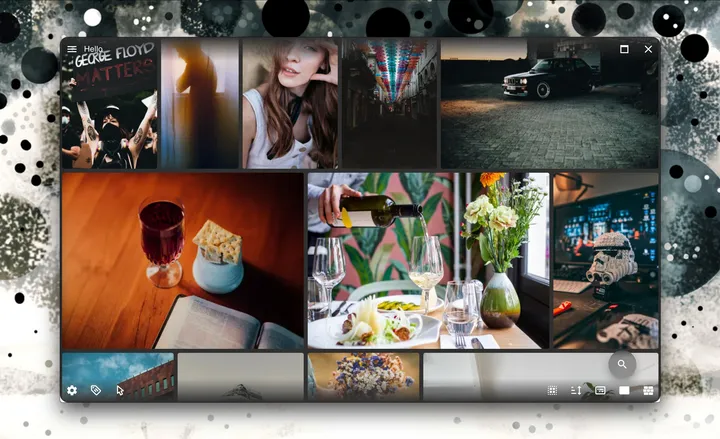
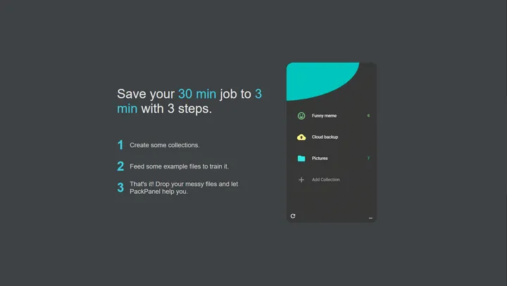
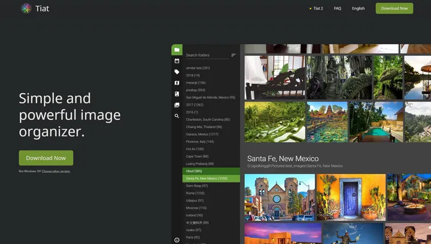

# Resume

Hi, I'm Eddie Hsu, a full-stack developer in Taiwan. I have 10 years of experience, skilled in web application development, both Front-end, Back-end, and especially cross-platform development.
* Contact Me: [apolkingg8@gmail.com](mailto:apolkingg8@gmail.com)
* Product Hunt: [https://www.producthunt.com/@eddiehsu](https://www.producthunt.com/@eddiehsu)
* Medium: [https://medium.com/@kingapol](https://medium.com/@kingapol)

## Skill
List some of my skilled/preferred stuff. Find more `Skill tags` in above section.
* Core pick: React, MobX, TypeScript, Rust(Neon/WASM)
* Front-end: Next.js, Material-ui, Ant design, PWA
* Back-end: Express, GraphQL, NestJS, TypeORM, MikroORM
* DevOps: Docker, GHAction
* Cross-platform: Electron, React Native, Tizen, WebOS
* Cloud Service: Usually use GCP, some experience in AWS

## Job

### SamaTech (2021~2022)
As a software architect, my main task is to analyze the project and design the architecture. I designed
the main architecture of SolomonDefi and image-api and implemented their backends. Both of them
are open source, you can check them out on GitHub.
* [SolomonDefi](https://github.com/SolomonDefi/solomon-monorepo) 
* [image-api](https://github.com/samatechtw/image-api)

`ethers.js`, `Docker`, `Skaffold`, `Nx`, `NestJS`

### Indie developer (2019~2021)
I have many ideas and passion, so I become an indie developer to build my projects.
Please check more about what I made in below section.
* [Tiat2](https://github.com/apolkingg8/apolkingg8/blob/master/RESUME.md#tiat2-2020now)
* [Tasmap](https://github.com/apolkingg8/apolkingg8/blob/master/RESUME.md#tasmap-20192020)
* [Markdium](https://github.com/apolkingg8/apolkingg8/blob/master/RESUME.md#markdium-2019)
* [PackPanel](https://github.com/apolkingg8/apolkingg8/blob/master/RESUME.md#packpanel-2019)
* [Tiat](https://github.com/apolkingg8/apolkingg8/blob/master/RESUME.md#tiat-2018)

### QCDN (2018 ~ 2019)
QCDN is a lean startup team, so I handled many different parts there. 
The most challenging thing is to improve backend performance and reduce the GCP cost. I did both. 
I reformed the backend service to a serverless architecture to resolve the performance issues, and also reduced the cost by more than 70%.

`GCP`, `WebOS`, `Tizen`, `Backend performance`

### KKStream (2016 ~ 2017)
As the only senior developer of the team, I designed the architecture for a modular CMS system and migrate from the legacy one.
Due to we are handling a large and complex system for Japanese customer, we need to maintain and migrate it very carefully.

`Next.js`, `GraphQL`, `Golang`, `gRPC`, `AWS`

### Plustek (2014 ~ 2016)
Built a [NAS-like storage system](https://plustek.com/tw/products/file-management-solution/edoc-series/index.php) which focus on business & education.
I took a lot of cross-platform techs (Cordova, NativeScript, React-Native) into our production, and be a [lecturer in MOPCON](http://mopcon.org/2018/speaker.php?id=9) a few years later.

`Ionic`, `React Native`, `Front-end`, `JAVA/Obj-c`

### Early career (2011 ~ 2014)
I tried many domains, both back-end, front-end, and mobile apps. 
I built a stock information software on Smart-TV for an investment company, it's a rare experience at that time.

`SmartTV(Samsung & Panasonic)`, `MySQL`, `jQuery, Backbone and other classic stuff`

## Made
I love to make something. For practice skill, for the self requirement, for display my ideal, or just for fun. Please check some of them on my [PH page](https://www.producthunt.com/@eddiehsu/made).

### Tiat2 (2020~now)
Tiat2 is a brand-new version of Tiat. With the user feedback from v1 and the experience of other products, it is more optimized in UX design, performance and many ways.
As the matter of experience of PackPanel, the "Similar image" and "Draw to search" feature has been improved a lot.
In Tiat2, I replaced the heavy-loading JS modules with Rust and WASM. It's improved 3x ~ 10x performance.
In addition, Tiat2 is developed in a TDD way, although it increases some development time, it also makes it very stable and reliable.

* WIP
* Electron app
* Base on MikroORM
* Improve performance with Rust & Rust-WASM
* Image recognition with self-designed algorithm
* File similarity with Tensorflow

### [Tasmap](https://tasmap.app) (2019~2020)
Tasmap is a customizable story map. You can customize your own map and write stories on it.
When it was released in 2020, Tasmap was highly rated on Product Hunt.
Even under the influence of COVID-19, Tasmap has provided a beautiful and practical map platform for thousands of travelers, local guides and data visualization workers from dozens of countries in the past year.
Tasmap is my first paid product. In addition to payment management, I have also accumulated a lot of experience in front-end performance and color design.

* Daily #6 on [Product hunt](https://www.producthunt.com/posts/tasmap)
* Beautiful design
* PWA base on Next.js
* Customizable PWA icon & splash screen
* Map rendering with MapboxGL, Pixi.js, Konva
* Medium-like clean rich text editor
* Customize & self-hosted map tiles
* Host on GCP with Cloud Function

### [Markdium](https://markdium.dev) (2019)
Just like its name, Markdium is a tool for converting and publishing from Markdown to Medium.
The most commonly used format by developers is Markdown, and the most popular article platform is Medium, so I built a bridge between the two.
Since Medium does not support the built-in Code highlight, Markdium will automatically convert the code block to Gist and embed into Medium.

* Launch on [Product hunt](https://www.producthunt.com/posts/markdium)
* Story on my [Medium post](https://medium.com/@kingapol/medium-in-markdown-without-pain-2785f50c092e)
* Clean UI design
* SPA base on Next.js
* Express backend
* Host on GCP Cloud Run & Cloud function

### [PackPanel](https://packpanel.island68.dev) (2019)
PackPanel is an experimental project, trying to use machine learning technology to solve the problem of local file classification.
I created a learning model and simple UI. When the user classifies certain files into a certain collection, PackPanel will analyze the characteristic values of these files and update the model.
Next time a new uncategorized file is added, PackPanel will try to classify it into similar collections.

* Launch on [Product hunt](https://www.producthunt.com/posts/packpanel)
* Electron app
* File classification
* Local ML by Tensorflow

### [Tiat](https://tiat.app) (2018)
Tiat is a picture management software that focuses on performance and search. 
I choose RocksDB as the main database, which handles maintaining performance under the million-level capacity. 
The other main features are "Similar image" and "Draw to search". Users can find the pictures they want with only a dim impression.
Tiat has been developed for more than two years. Although the update is suspended due to the development of v2, thousands of users are still using it every month.

* Launch on [Product hunt](https://www.producthunt.com/posts/tiat)
* Electron app
* RocksDB
* Computer vision
* Golang server on GCP

## Non-technical
* 10+ years of experience in baseball. A good hitter but terrible fielder.
* Tea, milk, beer, and Dr.Pepper. No coffee.
* Love cooking.
