# Resume

Hi, I'm Eddie Hsu, an indie developer in Taiwan. 8+ year experiences, skilled in web & cross-platform apps.
* Contact Me: [apolkingg8@gmail.com](mailto:apolkingg8@gmail.com)
* Product Hunt: https://www.producthunt.com/@eddiehsu/made
* Medium: https://medium.com/@kingapol

## Skill
List some of my skilled/preferred stuff. Find more `Skill tags` in above section.
* **Core pick**: React, MobX, TypeScript, Rust
* **Front-end**: Next.js, Material-ui
* **Back-end**: Express, GraphQL, TypeORM
* **Cross-platform**: Electron, React Native, Tizen, WebOS
* **Service**: Usually use GCP, some experience in AWS

## Job

### Early career (2011 ~ 2014)
I like to try new things and take the challenge, so I tried many domains.

`SmartTV(Samsung & Panasonic)`, `MySQL`, `jQuery, Backbone and other classic stuff`

### Plustek (2014 ~ 2016)
Front-end developer. Build [a NAS-like storage system](https://plustek.com/tw/products/file-management-solution/edoc-series/index.php) but focus on documents for companies & schools.

`Ionic`, `React Native`, `Front-end`, `JAVA/Obj-c`

### KKStream (2016 ~ 2017)
Full-stack developer. Build modularize CMS for digital assets.

`Next.js`, `GraphQL`, `Golang`, `gRPC`, `AWS`

### QCDN (2018 ~ 2019)
Full-stack developer. Build CDN services, dashboard, optimize back-end performance and reduce GCP cost.

`GCP`, `WebOS`, `Tizen`, `Backend performance`

### Indie developer (2019~)
Currently, I'm an indie developer, working on Tasmap & Tiat2. Check more below.

## Made
I love to make something. For practice skill, for the requirement from myself, to show my ideal, or just for fun. You can check some of them on my [PH page](https://www.producthunt.com/@eddiehsu/made).

### [Tiat](https://tiat.app) (2018)
Tiat is the first software I made, a picture management software that focuses on performance and search.
Tiat uses RocksDB as the main database, which is very fast on a large number of non-sequential reads, which also allows him to maintain performance under the million-level capacity.
In addition, I have implemented the functions of "Similar image" and "Draw to search" in Tiat, allowing users to find the pictures they want with only a dim impression.
Tiat has been developed for more than two years. Although the update is suspended due to the development of v2, thousands of users are still using it every month.

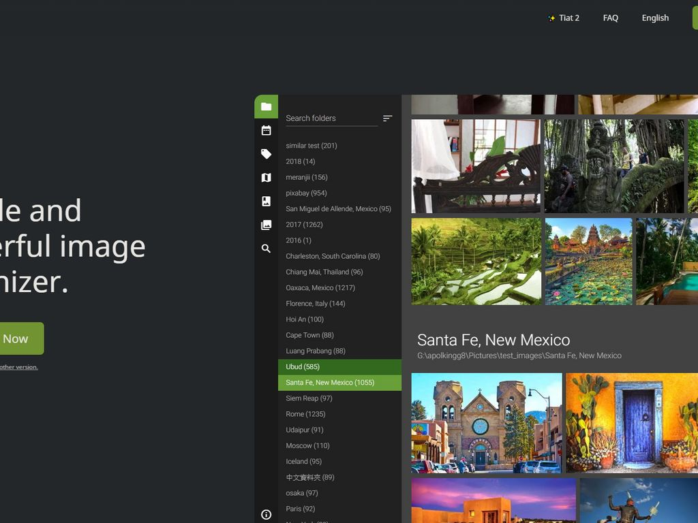

* App: `Electron`, `RocksDB`, `Image recognition`
* Service: `Golang`, `GCP(both Web & CI/CD)`

### [PackPanel](https://packpanel.island68.dev) (2019)
PackPanel is an experimental project, trying to use machine learning technology to solve the problem of local file classification.
I created a learning model and simple UI. When the user classifies certain files into a certain collection, PackPanel will analyze the characteristic values of these files and update the model.
Next time a new uncategorized file is added, PackPanel will try to classify it into similar collections.

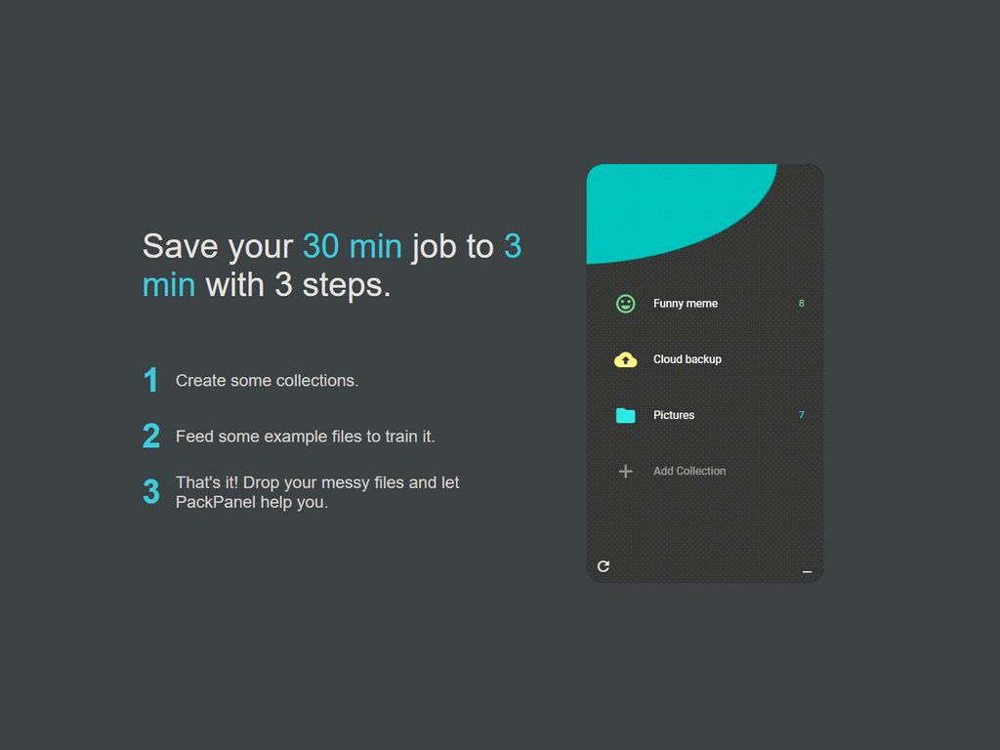

Step 1 | Step 2 | Step 3
:---:|:---:|:---:
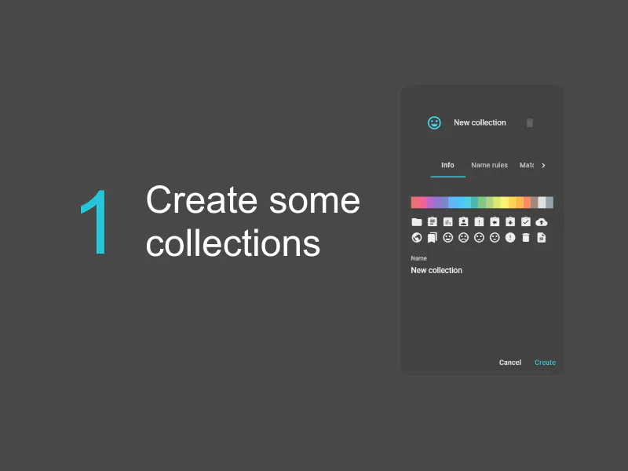 | 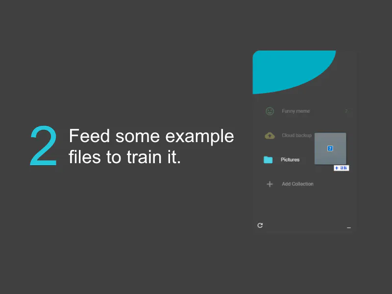 | 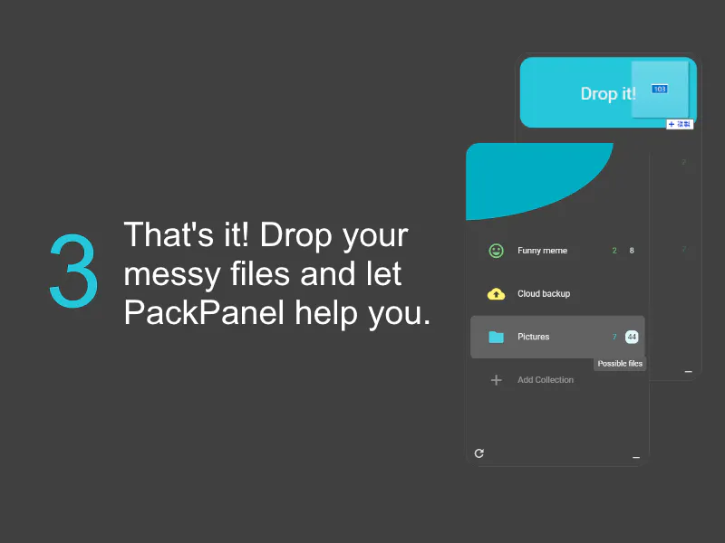

* `Electron`, `Tensorflow`, `File similarity`

### [Markdium](https://markdium.dev) (2019)
Just like its name, Markdium is a tool for converting and publishing from Markdown to Medium.
The most commonly used format by developers is Markdown, and the most popular article platform is Medium, so I built a bridge between the two.
Since Medium does not support the built-in Code highlight, Markdium will automatically convert the code block to Gist and embed into Medium.

Markdown editor | Connect with GitHub | Publish to Medium
:---:|:---:|:---:
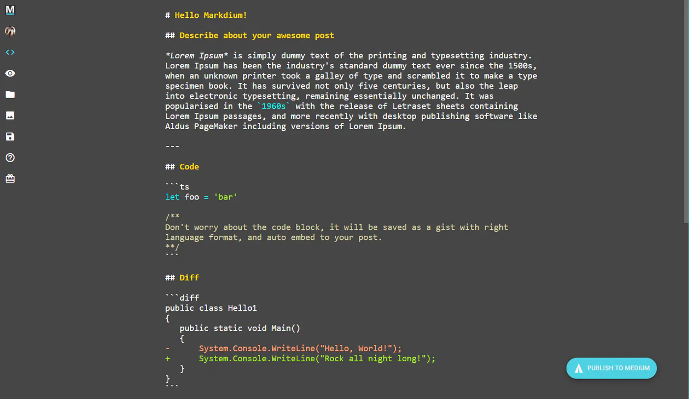 | 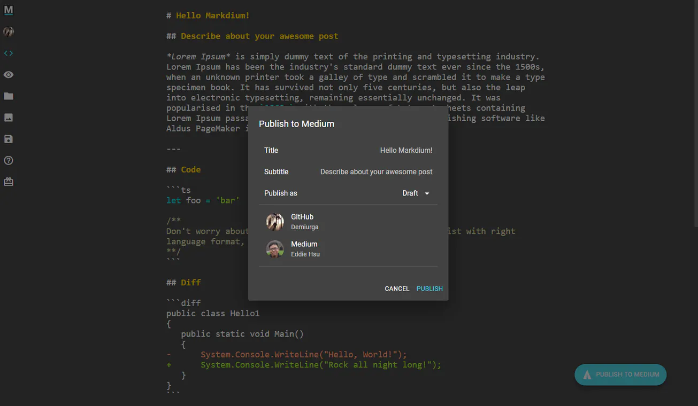 | 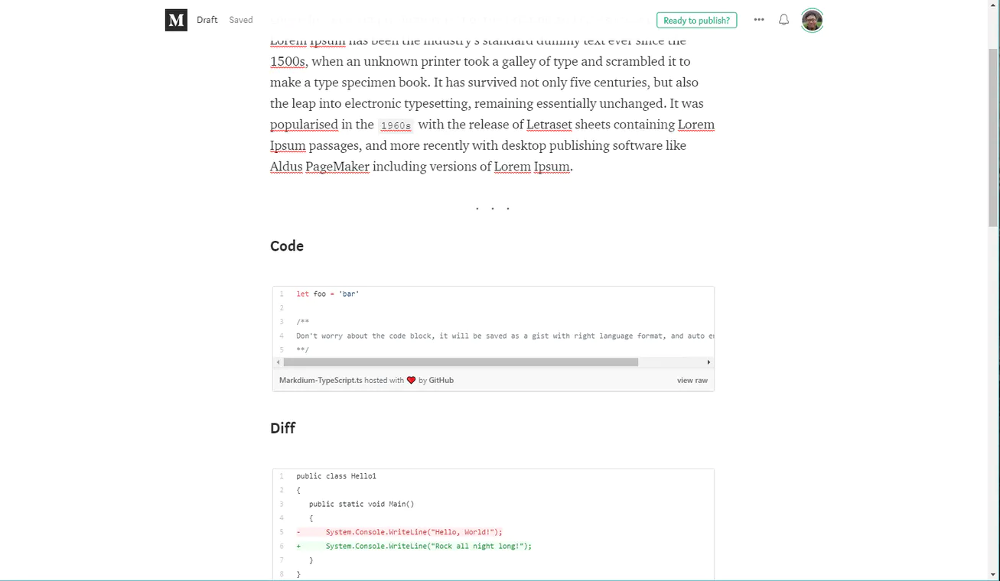

* Front-end: `Next.js`, `Markdown editor and parser`
* Back-end: `Express`, `GCP(Cloud Run, Cloud function, Cloud SQL)`

### [Tasmap](https://tasmap.app) (2019~2020)
Tasmap is a customizable story map. You can customize your own map and write stories on it.
When it was released in 2020, Tasmap was highly rated on Product Hunt.
Even under the influence of COVID-19, Tasmap has provided a beautiful and practical map platform for thousands of travelers, local guides and data visualization workers from dozens of countries in the past year.
Tasmap is my first paid product. In addition to payment management, I have also accumulated a lot of experience in front-end performance and color design.

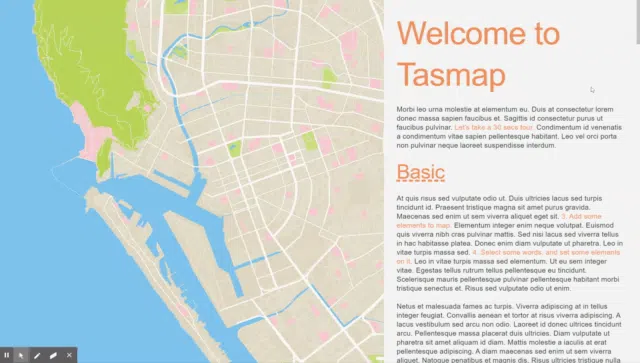

Dark|Light|Sakura|Macha|Hokusai|Hanafuda
:---:|:---:|:---:|:---:|:---:|:---:
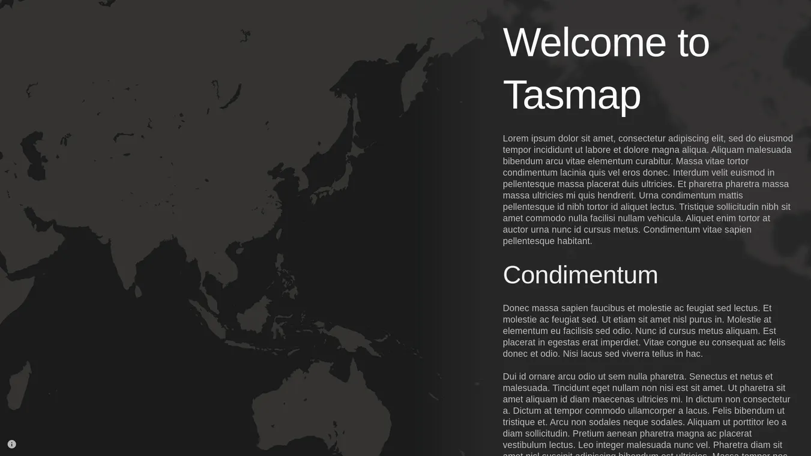|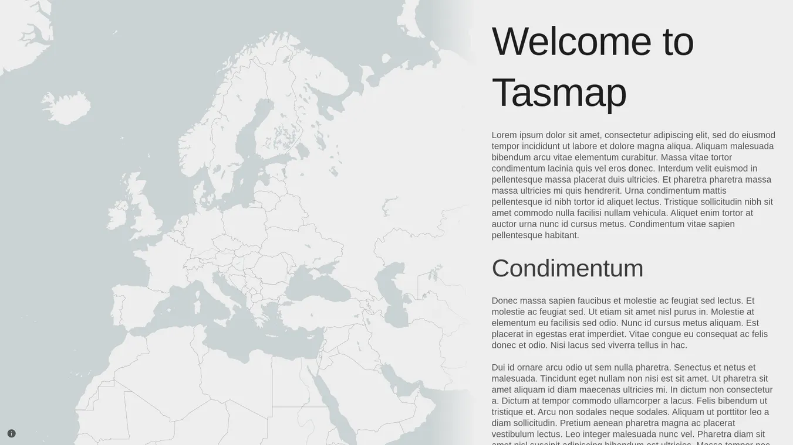|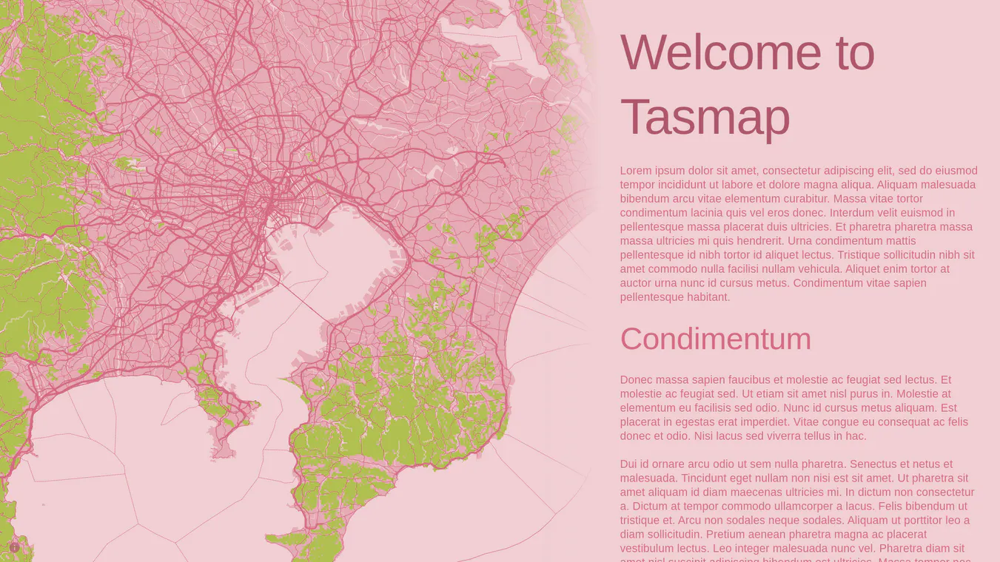|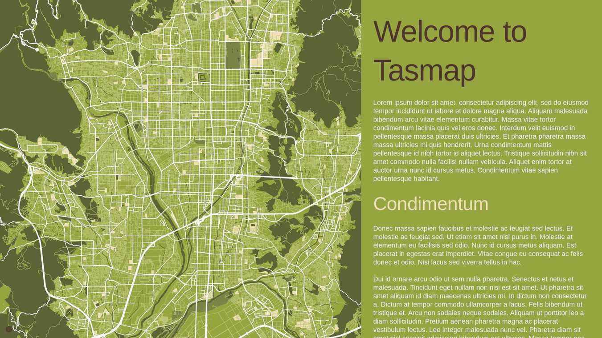|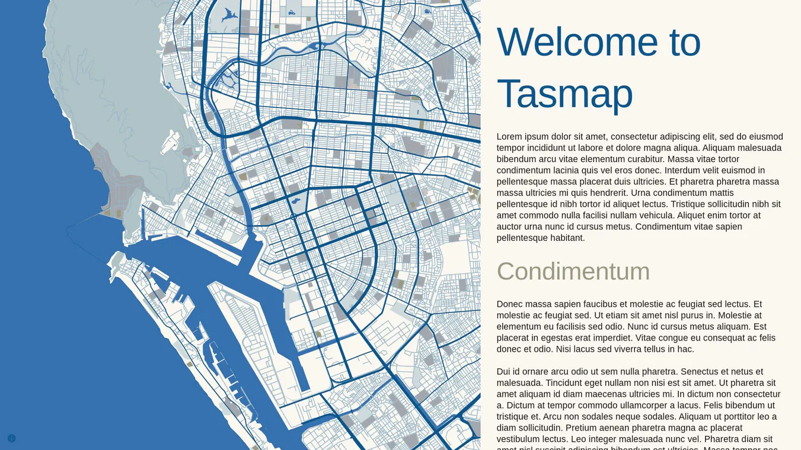|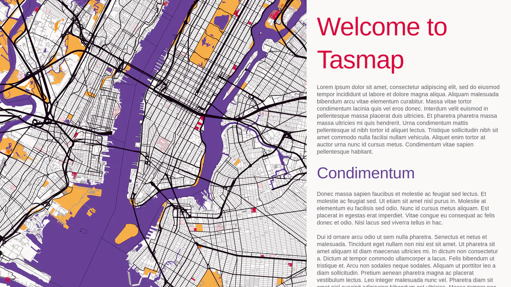

* Front-end: `Next.js`, `PWA`, `MapboxGL`, `Rendering performance(Pixi.js & Konva)`, `Rich text editor`, `Customize map tiles`
* Back-end: `Express`, `GCP(GAE, GCE, Cloud function)`

### Tiat2 (2020~2021)
Tiat2 is a brand-new version of Tiat. With the user feedback from v1 and the experience of other products, it is more optimized in UX design, performance and many ways.
As the matter of experience of PackPanel, the "Similar image" and "Draw to search" feature has been improved a lot.
In Tiat2, I replaced the heavy-loading JS modules with Rust and WASM. It's improved 3x ~ 10x performance.
In addition, Tiat2 is developed in a TDD way, although it increases some development time, it also makes it very stable and reliable.

* App: `Electron`, `Rust/Rust-wasm`, `TypeORM`, `Image recognition`, `File similarity`
* Service: `GCP(Web & SQL replication)`, `GH action(CI/CD)`

## Non-technical
* 10+ years of experience in baseball. A good hitter but terrible fielder.
* Tea, milk, beer, and Dr.Pepper. No coffee.
* Love cooking.
